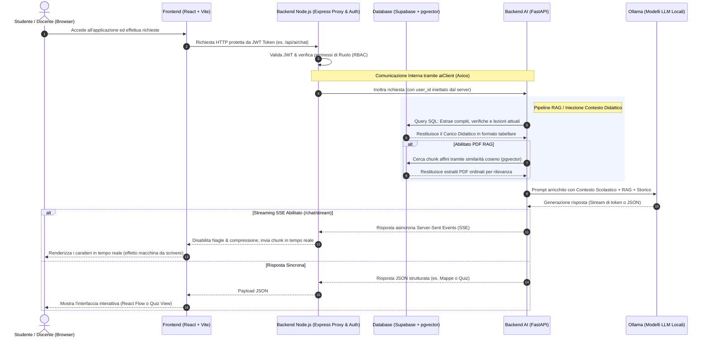

# 🎓 AI School Workspace — Guida alla Presentazione PowerPoint
> **Documentazione tecnica e slide-by-slide per la presentazione del progetto**
> *Focus speciale: Backend AI (FastAPI + Ollama) e flussi di comunicazione.*

Questo documento è stato strutturato per guidarti nella creazione e nell'esposizione della tua presentazione PowerPoint per il progetto **AI School Workspace**. È diviso in slide pronte per l'uso, ciascuna completa di **elementi visivi consigliati**, **punti chiave della slide** e il **discorso consigliato per il presentatore (Speech)**.

---

## 🗺️ Panoramica dell'Architettura del Sistema

Prima di iniziare con le slide, ecco uno schema riassuntivo del flusso di comunicazione che rappresenta il cuore tecnico della tua presentazione:



---

# 🛝 Struttura delle Slide (Slide-by-Slide)

## 📌 Slide 1: Titolo e Visione del Progetto
*La prima impressione: l'unione tra scuola tradizionale e intelligenza artificiale locale.*

* **Titolo della Slide:** `AI School Workspace: L'Evoluzione della Didattica Intelligente`
* **Sottotitolo:** `Un ecosistema scolastico integrato, potenziato da AI locale, RAG e pianificazione predittiva.`
* **Elementi Visivi Consigliati:** 
  * Un layout moderno a due colonne.
  * A sinistra: Il logo del progetto o uno screenshot accattivante dell'interfaccia (con il suo design premium scuro, glassmorphism e animazioni fluide).
  * A destra: Tre icone minimaliste ma d'impatto che rappresentano i pilastri: 
    * 🔒 *Sicurezza & Controllo Locale (Ollama)*
    * 📅 *Organizzazione Dinamica (Calendario Predittivo)*
    * 📚 *Studio Assistito (RAG PDF & Mappe Concettuali)*
* **Punti Chiave (Bullet Points nella slide):**
  * Piattaforma SaaS scolastica completa (Registro, Dashboard, Calendario).
  * Integrazione nativa di modelli linguistici di grandi dimensioni (LLM) totalmente **locali**.
  * Rispetto della privacy dello studente e nessun costo di API di terze parti.
  * Strumenti di apprendimento avanzati: Assistente vocale, generazione automatica di mappe concettuali e RAG su documenti.

---

### 🎙️ Speech (Discorso per il Presentatore):
> *"Buonasera a tutti. Oggi ho il piacere di presentarvi **AI School Workspace**, un progetto nato con l'obiettivo di rivoluzionare l'esperienza didattica quotidiana per studenti e insegnanti. 
> Spesso, le piattaforme scolastiche tradizionali sono dei semplici database statici di voti e compiti. Noi abbiamo voluto fare un salto nel futuro: abbiamo integrato un intero sistema scolastico digitale — comprensivo di registro elettronico, pianificazione delle lezioni e notifiche in tempo reale — con un motore di Intelligenza Artificiale sofisticato, sicuro e completamente privato. 
> La caratteristica fondamentale del nostro sistema è che l'AI gira **localmente**, senza inviare i dati personali degli studenti o della scuola a server esterni. Questo garantisce massima privacy e costi infrastrutturali pari a zero. Vediamo come funziona."*

---

## 📌 Slide 2: L'Architettura Generale e il Flusso dei Dati
*Spiegare in modo semplice ma rigoroso l'infrastruttura a 3 livelli.*

* **Titolo della Slide:** `L'Architettura a Tre Livelli (3-Tier Architecture)`
* **Elementi Visivi Consigliati:**
  * Diagramma a blocchi orizzontale o piramidale:
    1. **Frontend (React 18 + Vite):** Presentazione premium, grafici dinamici, libreria React Flow per le mappe, stato gestito con Zustand.
    2. **Backend Node.js (Express ESM):** Il "vigile urbano" del traffico. Gestisce autenticazione JWT, controllo degli accessi basato sui ruoli (RBAC), database relazionale e notifiche push (Socket.io).
    3. **Backend AI (FastAPI + Ollama):** Il cervello scientifico in Python. Esegue le pipeline di IA, gestisce i PDF, crea vettori e interroga l'LLM locale.
    4. **Database Comune (Supabase PostgreSQL + pgvector):** Memoria condivisa ad altissime prestazioni per compiti, voti, chat ed embeddings.
* **Punti Chiave (Bullet Points nella slide):**
  * **Separazione delle responsabilità:** La logica applicativa (Node) è isolata dai carichi computazionali dell'AI (Python/FastAPI).
  * **Comunicazione interna protetta:** Il frontend non parla direttamente con l'AI; ogni richiesta passa dal proxy Node.js che autentica l'utente.
  * **Sincronizzazione del Database:** Entrambi i server si appoggiano a un database unico **Supabase PostgreSQL**, garantendo consistenza immediata.

---

### 🎙️ Speech (Discorso per il Presentatore):
> *"Dietro un'interfaccia fluida e accattivante si nasconde un'architettura tecnica robusta e altamente scalabile, basata su tre livelli. 
> In primo luogo, abbiamo il **Frontend** sviluppato in React e Vite. È leggero, reattivo ed esteticamente premium, arricchito con animazioni e grafici.
> In secondo luogo, troviamo il **Backend applicativo in Node.js ed Express**. È colui che gestisce l'accesso alla piattaforma, la sicurezza con token JWT e il controllo dei ruoli (ad esempio, distinguendo cosa può fare un docente da cosa può vedere uno studente). 
> Il terzo livello è il **Backend AI**, un microservizio scritto in Python con **FastAPI**. Questa scelta ci ha permesso di sfruttare la velocità di FastAPI e l'immenso ecosistema di librerie di intelligenza artificiale di Python. 
> Entrambi i server si appoggiano a un database unico **Supabase PostgreSQL**, garantendo consistenza immediata."*

---

## 📌 Slide 3: Il Flusso di Comunicazione del Backend AI (FastAPI)
*Entriamo nel dettaglio: come avviene lo scambio di dati sicuro e reattivo.*

* **Titolo della Slide:** `Il Cuore del Backend AI & Flussi di Comunicazione`
* **Elementi Visivi Consigliati:**
  * Rappresentazione grafica del **Proxy Autenticato** (dal Frontend a Express, e poi la chiamata interna verso FastAPI sulla porta `:8000`).
  * Evidenziazione tecnica della chat in tempo reale: un box animato che simula la ricezione di pacchetti di testo per mostrare i **Server-Sent Events (SSE)**.
* **Punti Chiave (Bullet Points nella slide):**
  * **Proxying Trasparente:** L'Express API di Node.js funge da gateway sicuro inoltrando le chiamate a FastAPI tramite `aiClient` (Axios).
  * **Streaming a Bassa Latenza (SSE):** Supporto a Server-Sent Events nativo su FastAPI (`StreamingResponse`) e proxato in tempo reale da Node.js.
  * **Ottimizzazione del Canale:** Nel proxy Node.js viene disabilitato l'algoritmo di Nagle (`setNoDelay(true)`) e disabilitato il buffering della compressione per trasmettere i caratteri istantaneamente.
  * **Comunicazione Async:** Scambio dati tramite JSON strutturati e stream binari per l'elaborazione dell'audio.

---

### 🎙️ Speech (Discorso per il Presentatore):
> *"Concentriamoci ora su come avviene esattamente la comunicazione quando un utente interagisce con l'intelligenza artificiale. 
> Per motivi di sicurezza, il Frontend non effettua mai richieste dirette al server AI. Il server Node.js intercetta la richiesta del client, valida il suo token JWT per accertarne l'identità, estrae l'ID utente in modo sicuro a livello server e chiama il microservizio FastAPI.
> Per evitare che l'utente debba attendere 10 o 15 secondi prima di vedere la risposta dell'AI — cosa che rovinerebbe l'esperienza d'uso — abbiamo implementato lo **streaming dei dati in tempo reale** tramite **Server-Sent Events (SSE)**. 
> Dal punto di vista ingegneristico, questo ha richiesto un'ottimizzazione specifica nel backend Node.js: abbiamo configurato il proxy in modo da disabilitare il buffering di Express e il meccanismo di congestione di rete di Nagle. In questo modo, ogni singolo carattere generato dal modello Ollama locale viene sparato direttamente sullo schermo dello studente in tempo reale, senza interruzioni."*

---

## 📌 Slide 4: Chat Intelligente & Iniezione Dinamica del Contesto
*Come sconfiggere le allucinazioni dell'AI ancorandola ai dati reali della scuola.*

* **Titolo della Slide:** `Iniezione del Contesto Scolastico in Tempo Reale`
* **Elementi Visivi Consigliati:**
  * Diagramma di scomposizione del Prompt:
    ```
    Prompt Finale = [System Prompt (Tutor Tony)] + [Dati del Database (Compiti/Verifiche)] + [RAG PDF] + [Cronologia] + [Domanda Utente]
    ```
  * Un'icona a forma di imbuto (filtro euristico).
* **Punti Chiave (Bullet Points nella slide):**
  * **Rilevamento Euristico dell'Intento:** Il backend analizza l'ultimo messaggio per parole chiave (`compiti`, `verifiche`, `lezioni`).
  * **Query Dinamica al Database:** Se pertinente, il servizio `school_context_service.py` interroga PostgreSQL estraendo il carico didattico dei successivi 14 giorni dell'utente loggato.
  * **Generazione del Prompt Ancorato:** I dati reali (esami programmati, compiti in scadenza, argomenti spiegati) vengono formattati in Markdown e iniettati come istruzione di sistema insuperabile.
  * **Eliminazione delle Allucinazioni:** Il modello non inventa compiti o date perché è forzato a rispondere *esclusivamente* basandosi sul contesto iniettato.

---

### 🎙️ Speech (Discorso per il Presentatore):
> *"Uno dei problemi più grandi dei modelli linguistici generici è l'allucinazione: tendono a inventare fatti e date con estrema sicurezza. In una piattaforma scolastica questo è inammissibile. Uno studente non può sentirsi dire dall'AI che ha un esame di matematica domani se questo non è vero!
> Per risolvere questo problema, abbiamo progettato un sistema di **Iniezione Dinamica del Contesto**. Quando lo studente scrive all'assistente virtuale — che abbiamo battezzato 'Tony' —, un algoritmo euristico analizza il messaggio per capire se si parla di attività scolastiche.
> In caso positivo, il backend interroga immediatamente il database ed estrae il profilo dello studente, le sue classi, i compiti da consegnare, le interrogazioni e le verifiche programmate per le successive due settimane. 
> Questi dati reali vengono formattati in Markdown e iniettati all'interno delle istruzioni di sistema del modello. L'AI riceve così una fotografia esatta della situazione scolastica dello studente e risponde in modo ultra-personalizzato, ad esempio dicendo: 'Vedo che venerdì hai la verifica di storia ed hai ancora tre compiti di fisica da consegnare, organizziamo lo studio?'."*

---

## 📌 Slide 5: La Pipeline RAG (Retrieval-Augmented Generation) & pgvector
*Come il sistema impara da qualsiasi libro di testo in formato PDF.*

* **Titolo della Slide:** `La Pipeline RAG con pgvector`
* **Elementi Visivi Consigliati:**
  * Schema grafico lineare della pipeline RAG:
    `Caricamento PDF` ➔ `Estrazione Testo (pypdf)` ➔ `Splitting (RecursiveCharacterTextSplitter)` ➔ `Embeddings (nomic-embed-text)` ➔ `Storage in pgvector` ➔ `Rilevamento Query Semantica`
  * Tabella comparativa dei tre moduli generativi basati sull'intento (Generazione Quiz, Riassunto Gerarchico, Spiegazione Didattica).
* **Punti Chiave (Bullet Points nella slide):**
  * **Segmentazione Intelligente:** Testo suddiviso in chunk logici di 800 caratteri con overlap di 120 caratteri per preservare il contesto.
  * **Embeddings Vettoriali Locali:** Utilizzo del modello `nomic-embed-text` a 768 dimensioni tramite Ollama.
  * **Database Vettoriale Integrato:** Sfrutta l'estensione **pgvector** su PostgreSQL con indici ad alte prestazioni `ivfflat` per ricerche semantiche istantanee.
  * **Riconoscimento dell'Intento:** Rilevamento automatico dell'intento dell'utente per formattare l'output (Quiz didattico, Riassunto o Spiegazione passo-passo) citando sempre le pagine originali `[p. N]`.

---

### 🎙️ Speech (Discorso per il Presentatore):
> *"Ma non ci siamo fermati alla chat generica. Abbiamo dotato la piattaforma di una funzionalità di **RAG**, ovvero la generazione aumentata dal recupero di documenti. Studenti e docenti possono caricare sulla piattaforma i propri libri di testo o dispense in formato PDF.
> Quando un PDF viene caricato, il nostro backend AI lo analizza, estrae il testo pagina per pagina, e lo frammenta in segmenti logici di 800 caratteri sovrapposti. Ciascun frammento viene convertito in un vettore matematico a 768 dimensioni — chiamato embedding — tramite il modello locale `nomic-embed-text`.
> Questi vettori vengono salvati nel nostro database PostgreSQL sfruttando l'estensione **pgvector**. Quando lo studente fa una domanda su un capitolo del libro, convertiamo la sua domanda in un vettore e interroghiamo il database usando la similarità del coseno, recuperando all'istante i 5 frammenti di testo più rilevanti.
> Il sistema rileva in automatico cosa vuole lo studente: se chiede di essere interrogato, l'AI genera un quiz interattivo con risposte multiple o aperte; se chiede un riassunto, crea uno schema gerarchico; se chiede una spiegazione, adotta un tono didattico passo-passo. E, cosa fondamentale per lo studio, cita sempre la pagina esatta del PDF da cui ha estratto l'informazione."*

---

## 📌 Slide 6: Mappe Concettuali Generative (React Flow)
*Dalla prosa strutturata a un grafico di concetti interattivo.*

* **Titolo della Slide:** `Mappe Concettuali Interattive generate da AI`
* **Elementi Visivi Consigliati:**
  * Uno screenshot del componente grafico basato su React Flow (con nodi connessi da frecce etichettate).
  * Rappresentazione del JSON strutturato inviato dal server al client.
* **Punti Chiave (Bullet Points nella slide):**
  * **Estrazione Strutturata:** Il backend AI costringe l'LLM locale a estrarre i concetti centrali sotto forma di nodi e relazioni logiche (archi).
  * **JSON Rigido come Canale:** L'AI non risponde in linguaggio naturale, ma genera esclusivamente un oggetto JSON contenente `title`, `nodes` (con id e label in italiano) ed `edges` (collegamenti con verbo es. "conduce a").
  * **Doppio Livello di Sicurezza (Auto-Correction):** Se l'LLM commette un errore di sintassi JSON, il backend cattura l'eccezione, abbassa la temperatura a `0.0` (massima precisione) e riprova con un prompt forzato.
  * **Rendering Grafico Interattivo:** Il frontend React riceve la struttura ed esegue il rendering grafico modificabile tramite la libreria React Flow.

---

### 🎙️ Speech (Discorso per il Presentatore):
> *"Uno degli strumenti didattici più efficaci per la memorizzazione visiva sono le mappe concettuali. Realizzarle a mano richiede tempo, quindi abbiamo automatizzato il processo con l'AI.
> Lo studente inserisce un testo o seleziona un capitolo del libro e clicca su 'Genera Mappa'. A questo punto, il backend AI invia un prompt specifico al modello locale, imponendogli di agire come estrattore di grafi. L'AI non deve rispondere parlando, ma deve generare unicamente un file JSON strutturato con un elenco di concetti chiave — i nodi — e i relativi verbi di collegamento — gli archi.
> Chi lavora con i modelli linguistici sa che a volte possono fallire nella formattazione del JSON. Per ovviare a questo problema di affidabilità, abbiamo sviluppato una logica di **auto-correzione a due stadi**: se il parser rileva un JSON non valido, il sistema cattura l'errore in frazioni di secondo, abbassa a zero la temperatura del modello per renderlo estremamente deterministico e rieffettua la richiesta con istruzioni ancora più restrittive.
> Il risultato è un grafo impeccabile che viene inviato al Frontend e renderizzato tramite la libreria **React Flow**, consentendo allo studente di esplorare, trascinare, modificare e salvare la propria mappa concettuale personalizzata."*

---

## 📌 Slide 7: Calendario Predittivo & Suggerimento Carico Scolastico
*L'algoritmo ibrido per una scuola senza stress.*

* **Titolo della Slide:** `Pianificazione Predittiva: Algoritmo di Carico Didattico`
* **Elementi Visivi Consigliati:**
  * Una grafica che mostra una settimana scolastica con "barre di carico didattico" colorate (rosso per giorni carichi, verde per quelli scarichi).
  * Un'evidenziazione dell'algoritmo ibrido (Formulazione Matematica + Spiegazione LLM).
* **Punti Chiave (Bullet Points nella slide):**
  * **Algoritmo Ibrido Unico:** Combina calcolo matematico deterministico con sintesi descrittiva generata dall'Intelligenza Artificiale.
  * **Punteggio Deterministico del Carico:** Ogni giorno scolastico riceve un punteggio pesato:
    $$\text{Carico} = (0.5 \times \text{Compiti}) + (1.5 \times \text{Verifiche}) + (1.0 \times \text{Interrogazioni})$$
  * **Bonus Intelligente del Giorno:** L'algoritmo distribuisce le verifiche preferendo i giorni centrali della settimana (Mercoledì $+0.2$, Martedì/Giovedì $+0.1$) rispetto a Lunedì e Venerdì.
  * **LLM Guardrails (Output Validation):** L'AI spiega il motivo della scelta del giorno ideale. Il backend valida rigorosamente la risposta per evitare allucinazioni su date o timestamp ISO non ammessi.

---

### 🎙️ Speech (Discorso per il Presentatore):
> *"Una delle cause principali di stress per gli studenti è il sovraccarico di impegni: troppe verifiche concentrate negli stessi giorni della settimana. Per supportare i docenti nella programmazione e aiutare gli studenti a bilanciare lo studio, abbiamo ideato il **Calendario Predittivo**.
> Quando un professore vuole pianificare una nuova verifica, interroga il nostro sistema. Il backend non si limita a chiedere all'AI, che farebbe fatica a fare calcoli aritmetici esatti. Abbiamo invece creato un **approccio ibrido**.
> Prima di tutto, un algoritmo matematico determina il carico effettivo di ogni giorno della settimana corta (escludendo weekend e festivi) assegnando pesi specifici ad ogni impegno: le verifiche pesano molto (1.5), le interrogazioni mediamente (1.0) e i compiti a casa meno (0.5). L'algoritmo applica anche una preferenza pedagogica, dando un bonus ai giorni centrali come il mercoledì per evitare verifiche subito dopo il fine settimana o prima del weekend.
> Una volta calcolato matematicamente il giorno perfetto, passiamo il testimone all'AI locale. Il suo unico compito è generare una spiegazione fluida e comprensibile del perché quel giorno sia il migliore. Per garantire che l'AI non allucini date o violi la scelta matematica, il backend applica dei filtri di validazione severi sul testo generato: se l'AI cita date errate o mostra timestamp di programmazione, il sistema rifiuta la risposta dell'LLM e applica una spiegazione preimpostata. Sicurezza e chiarezza prima di tutto."*

---

## 📌 Slide 8: Interfaccia Vocale (Speech-to-Text & Text-to-Speech)
*Rendere l'applicazione inclusiva e accessibile tramite l'elaborazione dell'audio.*

* **Titolo della Slide:** `Assistenza Vocale: Accessibilità e Inclusione`
* **Elementi Visivi Consigliati:**
  * Diagramma del flusso audio bidirezionale:
    * In ingresso: `Voce Studente (Microfono)` ➔ `File Audio .webm` ➔ `Conversione WAV (pydub)` ➔ `Trascrizione (Google STT / Sphinx)` ➔ `Testo`
    * In uscita: `Testo Risposta AI` ➔ `Sintesi Vocale (gTTS)` ➔ `Stream MP3` ➔ `Riproduzione Browser`
* **Punti Chiave (Bullet Points nella slide):**
  * **Trascrizione Asincrona (STT):** Consente agli studenti di interagire parlando a voce.
  * **Conversione di Formato Integrata:** Il backend AI converte dinamicamente i codec web (come il `.webm` dei browser) in formato standard PCM `.wav` usando la libreria `pydub`.
  * **Fallback Offline Robust:** Utilizzo delle API Google Speech Recognition con fallback automatico e trasparente su **CMU Sphinx** in modalità totalmente offline.
  * **Sintesi Naturale (TTS):** Generazione di file MP3 fluidi a partire dalle risposte testuali dell'AI tramite la libreria `gTTS` per la lettura a voce delle spiegazioni.

---

### 🎙️ Speech (Discorso per il Presentatore):
> *"Un'applicazione didattica moderna deve essere inclusiva. Molti studenti con DSA o con difficoltà visive traggono enormi benefici dall'interazione vocale. Per questo abbiamo integrato funzioni complete di **Speech-to-Text** e **Text-to-Speech**.
> Lo studente può premere un tasto sul microfono e registrare la propria domanda. Il browser cattura l'audio in formato `.webm`, che viene inviato al backend. Qui, il nostro microservizio AI utilizza la libreria `pydub` per effettuare una conversione di codec al volo in formato WAV ad alta fedeltà.
> Successivamente, il motore di trascrizione converte l'audio in testo. Per garantire il funzionamento del sistema in ogni scenario, abbiamo configurato un doppio livello: utilizza il motore cloud ad alta precisione di Google e, in caso di assenza di connessione internet, scatta istantaneamente un fallback offline sul motore locale **CMU Sphinx**.
> Una volta elaborata la risposta testuale dall'AI, questa viene convertita in uno stream audio MP3 tramite gTTS ed inviata al browser, che la riproduce in modo naturale. Lo studente può quindi studiare dialogando a voce con il suo tutor AI, rendendo l'apprendimento estremamente accessibile."*

---

## 📌 Slide 9: Conclusioni e Punti di Forza
*Il riassunto finale del valore unico creato con questo progetto.*

* **Titolo della Slide:** `AI School Workspace: Il Futuro è Presente`
* **Elementi Visivi Consigliati:**
  * Tre cerchi concentrici che evidenziano i benefici per i tre attori principali della scuola:
    * 🧑‍🎓 **Per gli Studenti:** Studio personalizzato, meno stress organizzativo, accessibilità totale.
    * 👩‍🏫 **Per gli Docenti:** Supporto nella pianificazione dei carichi didattici, automazione della creazione di quiz.
    * 🏫 **Per l'Istituto:** Infrastruttura sicura, rispetto assoluto della privacy (GDPR compliant), costi di gestione minimi grazie all'AI locale.
* **Punti Chiave (Bullet Points nella slide):**
  * **100% Locale & Privata:** Nessun dato inviato all'esterno dell'infrastruttura scolastica.
  * **Unione di Algoritmi e Linguaggio:** L'AI non sostituisce la matematica e le regole deterministiche, ma le valorizza e le spiega.
  * **Esperienza d'Uso Premium:** Design curato nei minimi dettagli per attrarre e coinvolgere le nuove generazioni di studenti.
  * **Codice Pulito e Scalabile:** Pronta per l'espansione e l'integrazione con i registri ministeriali esistenti.

---

### 🎙️ Speech (Discorso per il Presentatore):
> *"Per concludere, **AI School Workspace** non è semplicemente un esercizio accademico o un prototipo. È un'infrastruttura didattica di livello enterprise, progettata per rispondere alle reali esigenze della scuola di oggi.
> Abbiamo dimostrato come sia possibile unire la flessibilità dei modelli di intelligenza artificiale moderni con il rigore dei dati deterministici scolastici. Abbiamo dato agli studenti un tutor privato disponibile 24 ore su 24 e ai docenti un assistente intelligente che semplifica il loro lavoro amministrativo e organizzativo.
> E lo abbiamo fatto ponendo al centro la sicurezza dei dati, la conformità alle normative sulla privacy e la sostenibilità economica. Con AI School Workspace, la scuola del futuro non è un sogno lontano, ma uno spazio di lavoro concreto, sicuro ed estremamente entusiasmante. 
> Grazie per l'attenzione. Sono a vostra completa disposizione per qualsiasi domanda tecnica o curiosità sul funzionamento del sistema."*

---

## 💡 Suggerimenti per la Presentazione (Consigli Pratici)

1. **La Demo dal Vivo (Live Demo):** Se possibile, fai una breve demo. Mostra la **generazione di una mappa concettuale** partendo da un testo e mostra come i nodi si collegano in italiano. Successivamente, apri la **RAG PDF** e fai una domanda specifica sul documento caricato per far vedere la citazione della pagina.
2. **Focus sulla Privacy:** Le commissioni d'esame e i docenti sono estremamente sensibili alla privacy e al GDPR. Rimarca con forza che **Ollama gira sulla macchina locale** (o sul server della scuola) e che nessun dato viene mai trasmesso a società esterne (come OpenAI o Google).
3. **Spiega bene l'ibridazione:** Il punto di forza del calendario predittivo è l'unione tra matematica ed LLM. Spiega che l'AI è ottima per "parlare" ma pessima a "far di conto", e che voi avete delegato la matematica al codice Python e la spiegazione discorsiva all'LLM. Questo denota una maturità ingegneristica molto alta.
