# 📊 ARCHITETTURA DI UNA PRESENTAZIONE DA MASTERCLASS: AI School Workspace
> **GUIDA ACCADEMICA AD ALTO IMPATTO VISIVO PER GEMINI PRO / POWERPOINT**
> *Progettata per sbalordire la commissione universitaria con un approccio B2B SaaS aziendale. Espansa a 13 Slide con fogli dedicati alle FUNZIONALITÀ ed ai relativi MOMENTI DEMO (Showcase) con mockup visivi.*

---

## 🎨 LINEE GUIDA DI DESIGN & PALETTE CROMATICA (Premium Dark Mode)
Per ottenere un effetto visivo "Premium SaaS" di forte impatto, applica questo tema grafico globale nelle impostazioni di PowerPoint o nel tuo generatore AI:
*   **Sfondo (Background):** Deep Space Obsidian (`#0A0E1A` - grigio scuro tendente al blu profondo).
*   **Accento Primario (Primary Active):** Electric Cyan (`#00F2FE` - ciano vibrante per elementi chiave).
*   **Accento Secondario (Secondary Glow):** Tech Violet (`#8A2BE2` - viola elettrico per evidenziazioni e sfumature).
*   **Testo Primario:** Pure Snow (`#FFFFFF` - bianco puro ad altissima leggibilità).
*   **Testo Secondario:** Muted Slate (`#94A3B8` - grigio freddo desaturato).
*   **Font Consigliati:** *Outfit* o *Inter* per i titoli (tratto geometrico, moderno); *Roboto* o *Plus Jakarta Sans* per i testi.

---

## 🗺️ SCHEMA CORE: L'Architettura del Flusso Informativo
*Da inserire nella Slide 2 o come elemento interattivo animato.*

```mermaid
sequenceDiagram
    autonumber
    actor Utente as Studente / Docente (Browser)
    participant Front as Frontend (React + Vite)
    participant Node as Backend Node.js (Express Proxy & Auth)
    participant DB as Database (Supabase + pgvector)
    participant AI as Backend AI (FastAPI)
    participant Ollama as Ollama (Modelli LLM Locali)

    Front->>Node: Richiesta HTTP protetta da JWT Token (es. /api/ai/chat)
    Node->>Node: Valida JWT & verifica permessi di Ruolo (RBAC)
    Note over Node, AI: Comunicazione Interna tramite aiClient (Axios)
    Node->>AI: Inoltra richiesta (con user_id iniettato dal server)
    
    rect rgb(24, 30, 48)
        note right of AI: Pipeline RAG / Iniezione Contesto Didattico
        AI->>DB: Query SQL: Estrae compiti, verifiche e lezioni attuali
        DB-->>AI: Restituisce il Carico Didattico in formato tabellare
        alt Abilitato PDF RAG
            AI->>DB: Cerca chunk affini tramite similarità coseno (pgvector)
            DB-->>AI: Restituisce estratti PDF ordinati per rilevanza
        end
    end

    AI->>Ollama: Prompt arricchito con Contesto Scolastico + RAG + Storico
    Ollama-->>AI: Generazione risposta (Stream di token o JSON)

    alt Streaming SSE Abilitato (/chat/stream)
        AI-->>Node: Risposta asincrona Server-Sent Events (SSE)
        Node-->>Front: Disabilita Nagle & compressione, invia chunk in tempo reale
        Front-->>Utente: Renderizza i caratteri in tempo reale (effetto macchina da scrivere)
    else Risposta Sincrona
        AI-->>Node: Risposta JSON strutturata (es. Mappe o Quiz)
        Node-->>Front: Payload JSON
        Front-->>Utente: Mostra l'interfaccia interattiva (React Flow o Quiz View)
    end
```

---

# 🛝 Progettazione Slide per Slide (Visual, Motion & Showcase)

## 📌 Slide 1: Enterprise-Grade Local AI E-Learning Platform
*L'unione perfetta tra registro elettronico classico e AI locale on-premise.*

*   **Titolo della Slide:** `AI School Workspace`
*   **Sottotitolo:** `Il Futuro della Didattica: Sicura, Predittiva e Inclusiva.`
*   **Struttura del Layout:**
    *   **Layout Asimmetrico (60/40):** 
        *   *A Sinistra (60%):* Uno screenshot ad altissima risoluzione dell'interfaccia utente (dashboard principale con design glassmorphism, sfocatura dello sfondo ed elementi neon).
        *   *A Destra (40%):* Tre carte fluttuanti (Card Glassmorphism) sovrapposte ad altezze diverse, che danno profondità 3D.
    *   **Iconografia:** Icone minimaliste al tratto neon (🔒 Sicurezza, 📅 Intelligenza Predittiva, 🎙️ Inclusività).
*   **Animazione & Effetti di Transizione:**
    *   **Transizione d'Ingresso:** Dissolvenza dal nero con apparizione in scala lenta dello screenshot principale.
    *   **Micro-Animazioni:** Le tre carte a destra entrano una alla volta dal basso con un leggero effetto molla (*Spring/Bounce*), distanziate di `0.3s`.
*   **Bullet Points Chiave (Sintesi per la slide):**
    *   **Data Sovereignty & GDPR Security:** Totale sovranità sul dato scolastico sensibile grazie a modelli LLM open-source (Ollama/Llama 3) eseguiti a perimetro locale (on-premises), garantendo la totale compliance GDPR (PII Protection).
    *   **Registro Intelligente & Interfaccia Predittiva:** Trasformazione del registro elettronico statico in un hub cognitivo asincrono a supporto dei flussi di lavoro di studenti e docenti.
    *   **Universal Design & Native Accessibility:** Accesso equo al servizio tramite un canale vocale bidirezionale (STT/TTS) asincrono ottimizzato per DSA e bisogni educativi speciali.

---

## 📌 Slide 2: Decoupled System Architecture & Vectorized Ledger
*Come dividere le responsabilità applicative per garantire prestazioni e sicurezza.*

*   **Titolo della Slide:** `Disaccoppiamento Applicativo & Sicurezza`
*   **Sottotitolo:** `L'Architettura a Tre Livelli con Memoria Condivisa Vettoriale.`
*   **Struttura del Layout:**
    *   **Layout a Griglia (4 Blocchi Connessi):** Quattro rettangoli con bordi arrotondati e contorni retroilluminati (Neon Glow) disposti a forma di flusso orizzontale.
        1.  *Blocco 1 (React 18 + Vite):* Colorazione Electric Cyan (`#00F2FE`).
        2.  *Blocco 2 (Express API Gateway):* Colorazione Tech Violet (`#8A2BE2`).
        3.  *Blocco 3 (FastAPI AI Engine):* Colorazione Cyber Green (`#00E676`).
        4.  *Blocco 4 (Supabase PostgreSQL + pgvector):* Posizionato sotto gli altri tre, connesso con frecce bidirezionali luminose.
*   **Animazione & Effetti di Transizione:**
    *   **Transizione:** **MORPH (Cangia)**. Lo screenshot della Slide 1 si dissolve rimpicciolendosi fino a diventare l'icona interna del blocco 1 (React), creando una continuità visiva eccezionale.
    *   **Micro-Animazioni:** Le frecce di connessione tra i blocchi si illuminano a scorrimento (effetto scorrimento dati o "pulsa") per far vedere la direzione dei dati dal client al database.
*   **Bullet Points Chiave (Sintesi per la slide):**
    *   **React 18 Single Page Application:** Frontend ultra-reattivo governato da Zustand per lo stato globale e Tailwind CSS per una UX premium glassmorphism.
    *   **Enterprise Node.js API Gateway:** Presidio di sicurezza basato su token JWT a doppia firma, controllo d'accesso granulare RBAC e comunicazioni in tempo reale via WebSocket.
    *   **Python FastAPI AI Microservice:** Gestore asincrono ad alta efficienza per l'orchestrazione di pipeline RAG, sintesi vocale e calcoli predittivi di carico didattico.
    *   **Unified Supabase/PostgreSQL + pgvector Store:** Unico database di persistenza relazionale integrato con estensione vettoriale, che minimizza i tempi di latenza e garantisce consistenza transazionale.

---

## 📌 Slide 3: Low-Latency Realtime Streaming: Server-Sent Events Proxy
*Sconfiggere la latenza dei modelli linguistici locali tramite streaming asincrono.*

*   **Titolo della Slide:** `Senza Latenza: Live Streaming SSE`
*   **Sottotitolo:** `Server-Sent Events Multiplexing ed Express Proxying.`
*   **Struttura del Layout:**
    *   **Split Layout (50/50):**
        *   *A Sinistra:* Un frammento di codice semplificato evidenziato con colori cyberpunk che mostra la disabilitazione dell'algoritmo di Nagle (`setNoDelay(true)`) e del buffering.
        *   *A Destra:* Una console animata o terminale scuro che simula la ricezione dei token di testo in tempo reale, evidenziando il flusso continuo di parole.
*   **Animazione & Effetti di Transizione:**
    *   **Transizione:** **MORPH**. Il Blocco 3 (FastAPI) e il Blocco 2 (Express) della Slide 2 si allargano e si posizionano al centro dello schermo, trasformandosi nello schema di proxying asincrono della Slide 3.
    *   **Micro-Animazioni:** Quando la slide si stabilizza, inizia la simulazione di digitazione automatica nella console a destra, mostrando visivamente il beneficio del flusso SSE.
*   **Bullet Points Chiave (Sintesi per la slide):**
    *   **Asynchronous Token Streaming:** Generazione nativa tramite FastAPI `StreamingResponse` con MIME-type `text/event-stream` ad aggancio rapido.
    *   **Express Chunk Proxying:** Inoltro immediato dei chunk di dati senza buffering intermedio o compressione GZIP in memoria gateway.
    *   **Nagle's Algorithm Bypass (`setNoDelay`):** Ottimizzazione TCP a basso livello sul socket di rete per forzare la trasmissione dei pacchetti IP senza delay indotti a livello kernel.
    *   **Zero-Latency UI Rendering:** Renderizzazione progressiva dei token sul client con effetto macchina da scrivere per minimizzare la latenza percepita dall'utente.

---

## 📌 Slide 4: Deterministic Context Grounding: Allucinazioni Zero
*Il superamento dei limiti degli LLM generici tramite iniezione automatica e sicura del database.*

*   **Titolo della Slide:** `Eliminazione delle Allucinazioni`
*   **Sottotitolo:** `Iniezione Dinamica del Contesto Didattico Realtime.`
*   **Struttura del Layout:**
    *   **Schema a "Panino" o Piramidale Verticale:**
        *   *In Alto:* Domanda dello studente ("Quando ho la verifica?").
        *   *Al Centro:* Filtro Euristico (Icona di un imbuto neon che si illumina).
        *   *Sotto il Filtro:* Il prompt finale risultante composto da diversi moduli di colore diverso (System Prompt, Dati DB del Registro, Richiesta).
*   **Animazione & Effetti di Transizione:**
    *   **Transizione:** **MORPH**. Il terminale di digitazione della Slide precedente scivola verso l'alto e diventa la "Domanda dello studente" in cima alla piramide di questa slide.
    *   **Micro-Animazioni:** Il filtro euristico si attiva con un impulso luminoso, e i blocchi del database didattico (compiti, lezioni, esami) compaiono uno alla volta incastrandosi come i pezzi di un puzzle sotto il prompt di sistema.
*   **Bullet Points Chiave (Sintesi per la slide):**
    *   **Keyword Intent Parser:** Filtro euristico preliminare sulle chiamate utente per intercettare query di registro didattico ed evitare colli di bottiglia computazionali sul DB.
    *   **Dynamic Context Extraction:** Query automatiche SQL che estraggono scadenze, voti e compiti dell'utente autenticato per un intervallo temporale predittivo di 14 giorni.
    *   **Strict System Guardrails:** Vincolo imperativo a livello prompt che limita il modello locale ad attenersi rigidamente e unicamente al contesto didattico reale iniettato.
    *   **Zero Data Leakage Boundary:** Elaborazione locale totale che impedisce qualsiasi trasmissione di PII dello studente a server cloud di terze parti.

---

## 📌 Slide 5: Document Retrieval-Augmented Generation (RAG) - La Pipeline
*La struttura ingegneristica dell'estrazione semantica e dell'embedding vettoriale.*

*   **Titolo della Slide:** `RAG: Studio e Comprensione Documentale`
*   **Sottotitolo:** `Pipeline di Embedding Locale e Analisi Vettoriale.`
*   **Struttura del Layout:**
    *   **Layout Tripartito (Pipeline Lineare):**
        *   *Fase 1 (Parsing & Splitting):* Icona PDF ➔ Chunk di 800 caratteri (overlap 120).
        *   *Fase 2 (Vector Storage):* Icona Matrice Vettoriale ➔ pgvector `nomic-embed-text` a 768 dimensioni.
        *   *Fase 3 (Semantic Match):* Grafico a dispersione 2D con punti vicini, evidenziando il calcolo dell'angolo di similarità coseno (`1 - (c.embedding <=> query_embedding)`).
*   **Animazione & Effetti di Transizione:**
    *   **Transizione:** Dissolvenza ad alta velocità con spostamento laterale (*Slide Right*).
    *   **Micro-Animazioni:** Un raggio di luce neon percorre le tre fasi della pipeline da sinistra a destra. Nella Fase 3, una linea connette la "Query dello studente" al chunk semantico più vicino all'interno dello spazio vettoriale.
*   **Bullet Points Chiave (Sintesi per la slide):**
    *   **Asynchronous Chunking & Parsing:** Estrazione di PDF nativi tramite `pypdf` con suddivisione semantica ricorsiva a 800 caratteri (overlap 120).
    *   **pgvector Cosine Distance Querying:** Stored procedure `match_pdf_chunks` per calcolare la distanza vettoriale coseno in millisecondi, velocizzata da indice `ivfflat`.
    *   **Nomic Embeddings Local Engine:** Conversione semantica del testo tramite modello open-source a 768 dimensioni eseguito on-premises.
    *   **Verifiable AI Insights & Quiz Engine:** Risposte adattive corredate da citazioni precise delle pagine sorgente `[p. N]` e generazione automatica di quiz didattici.

---

## 📌 Slide 6: [SHOWCASE 1] - Document RAG in Action
*Dimostrazione pratica del sistema di interrogazione dei PDF.*

*   **Titolo della Slide:** `SHOWCASE: Document RAG Live`
*   **Sottotitolo:** `Interrogazione Vettoriale ed Estrazione Citazioni in Tempo Reale.`
*   **Struttura del Layout:**
    *   **Layout a Due Colonne (Mockup di Prodotto):**
        *   *A Sinistra (40%):* Dettagli del test didattico. Un documento iconizzato come sorgente (es. `Dispensa_Sistemi.pdf`). Un elenco di domande poste a schermo.
        *   *A Destra (60%):* Una riproduzione grafica della chat reale dell'applicazione (Cyber Blue Gray con bordo Electric Cyan). Evidenzia una bolla di risposta AI con in rilievo l'etichetta di citazione neon `[p. 4]`.
        *   *Centro:* Grande etichetta traslucida: `[SPAZIO PER SCREENSHOT REALE DELLA DASHBOARD CHAT / PDF]`.
*   **Animazione & Effetti di Transizione:**
    *   **Transizione:** **MORPH** della pipeline logica che si converte nell'interfaccia utente finale.
    *   **Micro-Animazioni:** La bolla di chat contenente la citazione pulsa con un glow Electric Cyan per attirare l'attenzione sull'accuratezza.
*   **Bullet Points Chiave (Sintesi per la slide):**
    *   **Live PDF Upload:** Caricamento istantaneo delle dispense didattiche nel database vettoriale dell'utente.
    *   **Realtime Streaming Response:** Risposta asincrona visualizzata senza tempi di attesa tramite Server-Sent Events (SSE).
    *   **Precision Citations:** Riferimenti visivi cliccabili alla pagina reale della dispensa per la massima verificabilità.

---

## 📌 Slide 7: Generative Concept Mapping & React Flow Engine - La Logica
*Come strutturare ed auto-correggere grafi complessi.*

*   **Titolo della Slide:** `Mappe Concettuali Dinamiche`
*   **Sottotitolo:** `Constraint JSON Output, Auto-Correction & React Flow Rendering.`
*   **Struttura del Layout:**
    *   **Layout split diagonale o asimmetrico:**
        *   *A Sinistra:* Un blocco di codice JSON che rappresenta nodi (`nodes`) e archi (`edges`), con evidenziata un'eccezione sintattica sintattica catturata a runtime.
        *   *A Destra:* Un diagramma di flusso che mostra il ciclo di recovery: Richiesta ➔ JSON Corrotto ➔ Catch ➔ Forza Temp 0.0 ➔ Output Rigido ➔ React Flow Render.
*   **Animazione & Effetti di Transizione:**
    *   **Transizione:** Dissolvenza incrociata lenta (*Cross Fade*).
    *   **Micro-Animazioni:** Un segnale luminoso rosso "JSON Error Detected" si spegne e si accende una spunta verde neon "Syntax Repaired & Rendered".
*   **Bullet Points Chiave (Sintesi per la slide):**
    *   **Structured Entity-Relation Extraction:** Prompting avanzato che forza l'LLM a produrre esclusivamente payload JSON formattati con array di Nodes ed Edges.
    *   **Two-Stage Self-Healing Pipeline:** Rilevamento automatico di JSON corrotti, fallback a temperatura deterministica (`0.0`) e re-prompting istantaneo di correzione sintattica.
    *   **Dynamic React Flow Visualization:** Interfaccia a grafo 100% interattiva con ricalcolo degli archi in tempo reale durante il dragging dei nodi.

---

## 📌 Slide 8: [SHOWCASE 2] - Interactive React Flow Maps in Action
*Dimostrazione visiva della mappa concettuale generata.*

*   **Titolo della Slide:** `SHOWCASE: Grafi Relazionali Dinamici`
*   **Sottotitolo:** `Generazione di Mappe Concettuali e Manipolazione dei Nodi.`
*   **Struttura del Layout:**
    *   **Layout a Schermo Intero (Mockup di Interfaccia):**
        *   *Sfondo del Box:* Griglia a micropunti (dot-pattern) tipica dell'area di disegno di React Flow.
        *   *Al Centro:* Una mappa concettuale semplificata disegnata con forme geometriche native di PowerPoint (nodi arrotondati e frecce direzionali) che mostrano relazioni logiche (es. *"Sistema Nervoso"* ➔ *"Centrale"* ➔ *"Cervello"*).
        *   *Dettaglio:* Una mano stilizzata o un cursore mouse retroilluminato nell'atto di trascinare un nodo per mostrare l'interattività.
        *   *Centro:* Grande etichetta traslucida: `[SPAZIO PER SCREENSHOT REALE DELLA MAPPA GENERATA IN APP]`.
*   **Animazione & Effetti di Transizione:**
    *   **Transizione:** **MORPH** della logica della slide 7 che si materializza nel grafo reattivo della slide 8.
    *   **Micro-Animazioni:** Il nodo principale e i collegamenti si muovono leggermente simulando un riposizionamento dinamico automatico.
*   **Bullet Points Chiave (Sintesi per la slide):**
    *   **Zero staticità:** Le mappe generate non sono immagini raster, ma oggetti web interamente interattivi.
    *   **Direct Graph Modification:** Possibilità di aggiungere nodi, editare connessioni logiche e riorganizzare lo spazio visivo a mano.
    *   **Save & Resume:** Memorizzazione dei grafi in Supabase PostgreSQL per future sessioni di studio.

---

## 📌 Slide 9: Hybrid Predictive Scheduling: Algoritmo Calendario - Il Calcolo
*L'unione perfetta tra il rigore matematico delle euristiche e la sintesi descrittiva dell'Intelligenza Artificiale.*

*   **Titolo della Slide:** `Pianificazione Didattica Bilanciata`
*   **Sottotitolo:** `Algoritmo Ibrido Deterministico-Semantico per il Carico Didattico.`
*   **Struttura del Layout:**
    *   **Layout a Due Livelli Verticali:**
        *   *Livello Alto (Il Calcolo):* Rappresentazione grafica della formula matematica del carico didattico pesato con icone colorate.
        *   *Livello Basso (La Spiegazione):* Una finestra di chat in stile fumetto che racchiude la motivazione colloquiale generata dall'AI.
*   **Animazione & Effetti di Transizione:**
    *   **Transizione:** Dissolvenza ad incrocio lento (*Cross Fade*).
    *   **Micro-Animazioni:** Il grafico delle barre di carico della settimana subisce una variazione in tempo reale: la barra del giorno ideale (es. Mercoledì) si abbassa e riceve un contorno luminoso verde smeraldo.
*   **Bullet Points Chiave (Sintesi per la slide):**
    *   **Quantitative Cognitive Load Score:** Algoritmo deterministico pesato: Carico = (0.5 * Compiti) + (1.0 * Interrogazioni) + (1.5 * Verifiche).
    *   **Pedagogical Preference Heuristics:** Assegnazione automatica di punteggi bonus ai giorni infrasettimanali centrali per prevenire burn-out e picchi da weekend (Mercoledì +0.2).
    *   **Explainable AI Commentary:** Sintesi naturale di Ollama che argomenta in italiano corrente i vantaggi logistici del giorno ideale individuato dal calcolo.
    *   **Strict Output Validation:** Meccanismo a backend che valida la consistenza delle date generate per evitare leak di timestamp e allucinazioni temporali.

---

## 📌 Slide 10: [SHOWCASE 3] - Balanced Calendar in Action
*Dimostrazione visiva della pianificazione automatica del carico scolastico.*

*   **Titolo della Slide:** `SHOWCASE: Calendario Predittivo`
*   **Sottotitolo:** `Feedback Cromatico del Carico Didattico e Allocazione Intelligente.`
*   **Struttura del Layout:**
    *   **Layout a Griglia (Mockup Calendario):**
        *   *In Alto:* Una griglia settimanale (Lunedì-Venerdì) con barre verticali che indicano il carico. Lunedì ha una colonna Cyber Red (carico alto), Mercoledì ha una colonna Cyber Green (carico basso) circondata da un glow neon verde.
        *   *In Basso:* Un box di notifica arrotondato con bordo Tech Violet contenente una citazione testuale della giustificazione dell'AI (es. *"Ti consiglio mercoledì..."*).
        *   *Centro:* Grande etichetta traslucida: `[SPAZIO PER SCREENSHOT REALE DELLA GRIGLIA CALENDARIO CON NOTIFICA AI]`.
*   **Animazione & Effetti di Transizione:**
    *   **Transizione:** **MORPH** della formula matematica della slide precedente che si riduce per incapsularsi nell'algoritmo di calcolo del calendario.
    *   **Micro-Animazioni:** La colonna del Mercoledì e la notifica AI compaiono con un leggero effetto dissolvenza ed espansione graduale (*Fade In & Scale*).
*   **Bullet Points Chiave (Sintesi per la slide):**
    *   **Visual Cognitive Load:** Gli studenti e i docenti vedono istantaneamente lo stato di stress della settimana tramite colori intuitivi.
    *   **Automated Scheduling Advice:** Inserimento facilitato di nuove prove didattiche con suggerimento automatico del giorno ideale.
    *   **Human-Readable Justification:** Motivazione discorsiva immediata per evitare conflitti e giustificare la scelta scientificamente.

---

## 📌 Slide 11: Natural Audio Channels & Native Inclusivity - La Logica
*La struttura ingegneristica della pipeline di conversione vocale.*

*   **Titolo della Slide:** `Inclusività & Assistenza Vocale`
*   **Sottotitolo:** `Speech-to-Text asincrono con CMU Sphinx Offline Fallback.`
*   **Struttura del Layout:**
    *   **Diagramma di Flusso Circolare o a Specchio:**
        *   *Metà Sinistra (Input Vocale):* Onda sonora ➔ Conversione WAV (`pydub`) ➔ Trascrizione (Google Cloud STT / Sphinx Offline).
        *   *Metà Destra (Output Vocale):* Testo ➔ Generazione MP3 (`gTTS`) ➔ Audio Player nel browser.
*   **Animazione & Effetti di Transizione:**
    *   **Transizione:** **MORPH**. Lo schema del calendario si contrae per diventare la barra del player audio al centro della Slide 11.
    *   **Micro-Animazioni:** Un'onda sonora animata (effetto equalizzatore grafico) si muove sul lato dell'input vocale quando la slide è attiva.
*   **Bullet Points Chiave (Sintesi per la slide):**
    *   **Dynamic Audio Transcoding:** Conversione dinamica tramite `pydub` da flussi web compressi `.webm` in formato lossless WAV PCM 16-bit.
    *   **Dual-Engine Speech-to-Text:** Trascrizione ibrida basata su Google Speech API online con fallback immediato offline su CMU Sphinx in caso di problemi di rete.
    *   **Zero-Latency Text-to-Speech:** Generazione dinamica di risposte audio MP3 di alta qualità tramite motore di sintesi vocale (gTTS).
    *   **Inclusione WCAG & Accessibilità DSA:** Interfaccia accessibile progettata per eliminare le barriere fisiche e mentali legate all'uso della tastiera.

---

## 📌 Slide 12: [SHOWCASE 4] - Speech-to-Text & Vocal Access in Action
*Dimostrazione dell'assistenza vocale per DSA e accessibilità.*

*   **Titolo della Slide:** `SHOWCASE: Accessibilità Vocale`
*   **Sottotitolo:** `Dialogo Naturale Bidirezionale Asincrono Interamente Locale.`
*   **Struttura del Layout:**
    *   **Layout split o concentrico:**
        *   *Al Centro:* Un grande cerchio pulsante Electric Cyan rappresentante il pulsante del microfono in stato di registrazione, circondato da cerchi concentrici traslucidi (onde d'urto sonore).
        *   *In Basso:* Due fumetti sovrapposti in stile SaaS: uno rappresenta il testo trascritto dall'utente ("Quali compiti ho domani?") e l'altro la risposta audio letta dal sistema.
        *   *Centro:* Grande etichetta traslucida: `[SPAZIO PER SCREENSHOT REALE DELLA SEZIONE VOCE E EQUALIZZATORE]`.
*   **Animazione & Effetti di Transizione:**
    *   **Transizione:** **MORPH** dell'onda sonora logica che si converte nei cerchi d'urto concentrici del microfono.
    *   **Micro-Animazioni:** I cerchi concentrici si allargano in loop infinito per dare il senso visivo della registrazione audio attiva.
*   **Bullet Points Chiave (Sintesi per la slide):**
    *   **Hands-Free Interaction:** Possibilità di interrogare il registro didattico e studiare i PDF interamente a voce.
    *   **Zero Net Dependency:** Funzionamento garantito all'interno delle aule scolastiche grazie alla trascrizione CMU Sphinx interamente offline.
    *   **DSA Empowerment:** Strumento inclusivo progettato in conformità alle linee guida per l'accessibilità digitale e inclusione.

---

## 📌 Slide 13: Enterprise Value Proposition & Local AI Revolution
*Il riepilogo del valore unico creato unendo sicurezza, didattica e riduzione dei costi reali.*

*   **Titolo della Slide:** `La Rivoluzione della Didattica Locale`
*   **Sottotitolo:** `AI School Workspace: Sicurezza, Zero Costi API, Efficacia Didattica.`
*   **Struttura del Layout:**
    *   **Layout a 3 Colonne Grandi (Card Elevate):** Tre grandi rettangoli verticali retroilluminati:
        *   *Colonna 1 (Per lo Studente):* Icona Cappello Laurea. Studio assistito, mappe interattive e minore ansia da sovraccarico didattico.
        *   *Colonna 2 (Per il Docente):* Icona Registro/Pianificazione. Supporto oggettivo per programmare prove e creare quiz didattici.
        *   *Colonna 3 (Per la Scuola):* Icona Scudo Server. Protezione al 100% dei dati dei minori, conformità GDPR integrata e zero costi per API OpenAI/Google.
*   **Animazione & Effetti di Transizione:**
    *   **Transizione:** **MORPH** estremo. Gli schemi visivi della Slide precedente si fondono e si allargano diventando i tre pilastri finali.
    *   **Micro-Animazioni:** Ciascuna colonna si eleva verso l'alto con un effetto zoom quando viene discussa dal relatore.
*   **Bullet Points Chiave (Sintesi per la slide):**
    *   **Absolute Data Privacy:** Garanzia totale di riservatezza sui dati sensibili dei minori grazie all'infrastruttura di calcolo on-premises (GDPR compliant).
    *   **Zero Costi Ricorrenti di Licenza:** Modello di business sostenibile a costo marginale zero, slegato da API cloud a consumo di OpenAI o Google.
    *   **Algoritmi Ibridi di Ottimizzazione:** Equilibrio perfetto tra rigore logico deterministico e intelligenza generativa discorsiva.
    *   **Production-Ready Deployment:** Intero ecosistema containerizzato con Docker Compose, configurato e pronto per la distribuzione con un solo comando.
