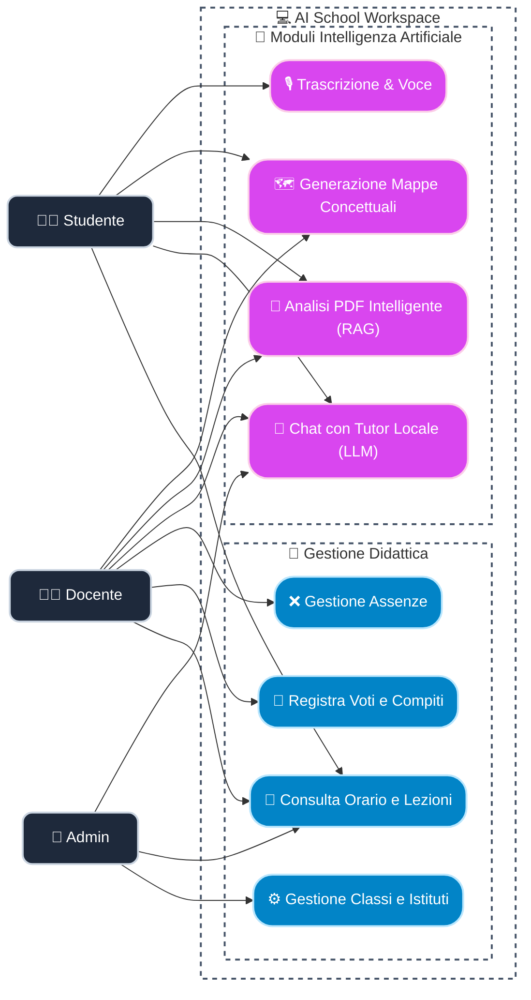
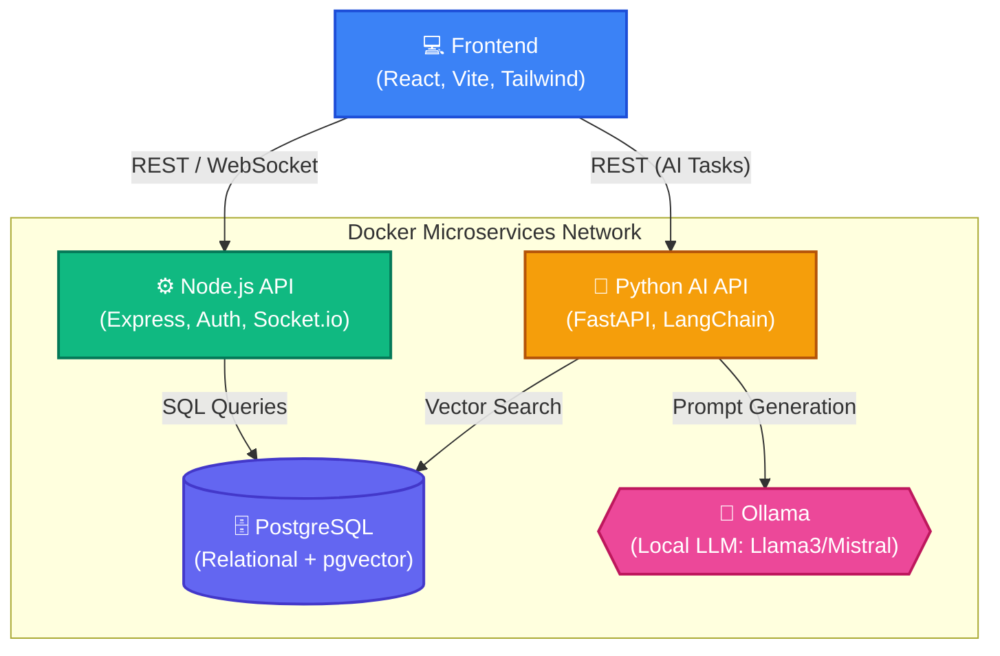
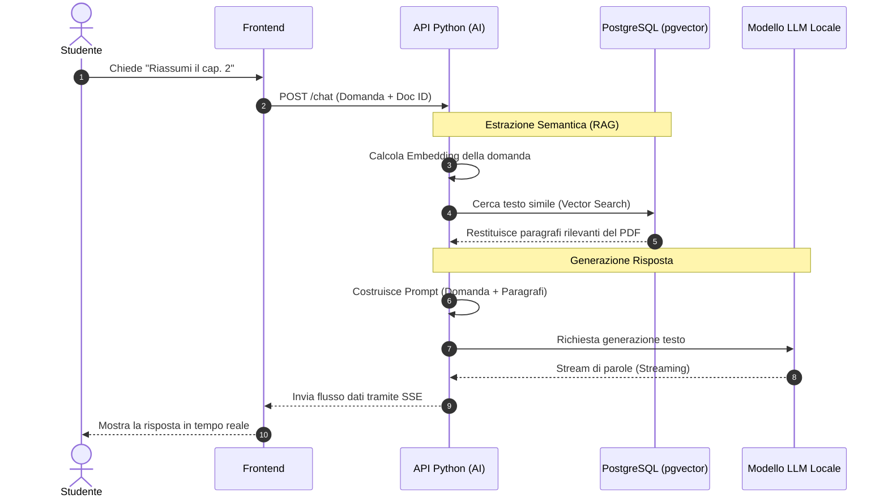

# Pacchetto UML per Presentazione (Maturità / Università)

Questi diagrammi sono stati ottimizzati per essere chiari, non troppo affollati e perfetti da inserire nelle slide (puoi fare uno screenshot del diagramma renderizzato oppure usare tool come Mermaid Live Editor per esportarli in PNG ad alta risoluzione). 

Per ogni diagramma troverai anche un **suggerimento su come presentarlo** a voce alla commissione.

---

## 1. Diagramma dei Casi d'Uso (Use Case Diagram)
**Slide consigliata:** "Funzionalità e Ruoli del Sistema"
**Come spiegarlo:** *"Il sistema prevede tre attori principali con permessi crescenti. Lo Studente fruisce dei contenuti e consulta l'orario. Il Docente gestisce la didattica quotidiana. L'Amministratore (Admin) ha una visione 'onnisciente' dell'istituto e gestisce l'infrastruttura di base."*

*(Nota: Attualmente Mermaid ha un supporto limitato per i diagrammi dei casi d'uso nativi rispetto a PlantUML, ma possiamo modellarlo visivamente con un diagramma a grafo direzionale molto pulito che rende benissimo sulle slide)*

---

## 2. Architettura di Sistema (Deployment / Component Diagram)
**Slide consigliata:** "Infrastruttura e Tecnologie Utilizzate"
**Come spiegarlo:** *"Ho adottato un'architettura a microservizi basata su Docker. Il cuore del sistema è diviso in due: un backend Node.js ultra-veloce per la gestione scolastica e i Websocket, e un backend Python con FastAPI dedicato all'intelligenza artificiale, che comunica con un modello LLM eseguito totalmente in locale per garantire la privacy dei dati scolastici."*

---

## 3. Flusso AI e RAG (Sequence Diagram)
**Slide consigliata:** "Integrazione dell'Intelligenza Artificiale (RAG)"
**Come spiegarlo:** *"Questo diagramma di sequenza mostra il funzionamento del Retrieval-Augmented Generation (RAG). Quando uno studente fa una domanda su un file PDF, il backend non interroga ciecamente l'AI, ma estrae dal database i paragrafi matematicamente più simili alla domanda, creando un contesto specifico. Questo impedisce all'intelligenza artificiale di 'allucinare' e inventare risposte."*

---

## 4. Rappresentazione Reale del Database (Complete ER Diagram)
**Slide consigliata:** "Schema Relazionale e Architettura Dati Completa"
**Come spiegarlo:** *"Questo è lo schema logico reale del database PostgreSQL che ho progettato. Si può notare la divisione in due macro-aree: a sinistra le tabelle classiche per la gestione dell'istituto (utenti, classi, orari, assenze e voti) con vincoli di integrità. A destra, l'ecosistema dell'Intelligenza Artificiale, con i vettori matematici `(vector 768)` salvati tramite pgvector per il Retrieval-Augmented Generation, oltre alle strutture per storicizzare le chat e le mappe concettuali. È un ibrido tra database transazionale e vector-database."*

```mermaid
erDiagram
    %% Core Users & Roles
    USERS ||--o{ CLASSES : "owner_id"
    USERS ||--o{ CLASS_MEMBERS : "user_id"
    CLASSES ||--o{ CLASS_MEMBERS : "class_id"

    %% School Management
    CLASSES ||--o{ SCHEDULES : "class_id"
    USERS ||--o{ SCHEDULES : "teacher_id"
    
    CLASSES ||--o{ HOMEWORK : "class_id"
    USERS ||--o{ HOMEWORK : "assigned_by"
    
    CLASSES ||--o{ LESSONS : "class_id"
    USERS ||--o{ LESSONS : "teacher_id"

    CLASSES ||--o{ ABSENCES : "class_id"
    USERS ||--o{ ABSENCES : "user_id"

    CLASSES ||--o{ EXAMS : "class_id"
    USERS ||--o{ EXAMS : "teacher_id"

    CLASSES ||--o{ INTERROGATIONS : "class_id"
    USERS ||--o{ INTERROGATIONS : "student_id (or teacher)"

    %% AI Modules
    USERS ||--o{ AI_CHATS : "user_id"
    AI_CHATS ||--o{ AI_MESSAGES : "chat_id"

    USERS ||--o{ PDF_DOCUMENTS : "user_id"
    PDF_DOCUMENTS ||--o{ PDF_CHUNKS : "document_id"

    USERS ||--o{ CONCEPT_MAPS : "user_id"
    PDF_DOCUMENTS |o--o{ CONCEPT_MAPS : "source_pdf_id"

    USERS ||--o{ NOTIFICATIONS : "user_id"

    %% Tables Definition
    USERS {
        uuid id PK
        varchar email
        varchar full_name
        user_role role "student | teacher | admin"
    }
    
    CLASSES {
        uuid id PK
        varchar name
        varchar school_year
        uuid owner_id FK
    }
    
    CLASS_MEMBERS {
        uuid class_id PK, FK
        uuid user_id PK, FK
        user_role role
    }

    SCHEDULES {
        uuid id PK
        uuid class_id FK
        smallint weekday
        time start_time
        time end_time
    }

    HOMEWORK {
        uuid id PK
        uuid class_id FK
        varchar title
        date due_date
        smallint priority
    }

    LESSONS {
        uuid id PK
        uuid class_id FK
        varchar title
        date taught_on
    }

    ABSENCES {
        uuid id PK
        uuid user_id FK
        date date
        boolean justified
    }

    EXAMS {
        uuid id PK
        uuid class_id FK
        timestamp scheduled_for
        text[] topics
    }

    INTERROGATIONS {
        uuid id PK
        uuid class_id FK
        timestamp scheduled_for
        numeric grade
    }

    AI_CHATS {
        uuid id PK
        uuid user_id FK
        varchar title
        varchar model
    }

    AI_MESSAGES {
        uuid id PK
        uuid chat_id FK
        varchar role "system|user|assistant"
        text content
    }

    PDF_DOCUMENTS {
        uuid id PK
        uuid user_id FK
        varchar filename
        varchar status
    }

    PDF_CHUNKS {
        uuid id PK
        uuid document_id FK
        integer chunk_index
        vector embedding "Vettore a 768 dimensioni (pgvector)"
        text content
    }

    CONCEPT_MAPS {
        uuid id PK
        uuid user_id FK
        jsonb graph "Nodi e archi React Flow"
    }

    NOTIFICATIONS {
        uuid id PK
        uuid user_id FK
        notification_type type
        boolean read_at
    }
```

---
### 💡 Consigli per l'uso nella Presentazione:
1. **Poche scritte sulle slide**: Usa questi diagrammi come elemento visivo principale della slide e parla tu per spiegare i passaggi.
2. **Colori coerenti**: I diagrammi Mermaid generati si adatteranno al tema scuro/chiaro del tuo editor Markdown, se li estrai tramite [Mermaid Live](https://mermaid.live/) puoi personalizzare il tema (`Base`, `Forest`, `Dark`).
3. **Punta sull'innovazione**: Ai professori piacerà moltissimo il fatto che tu non ti sia limitato a un semplice gestionale (CRUD), ma abbia integrato concetti universitari avanzati come i **Microservizi**, il **Vector Database** e l'**Esecuzione locale dell'LLM**.
